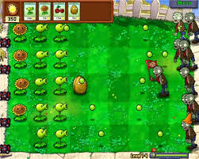
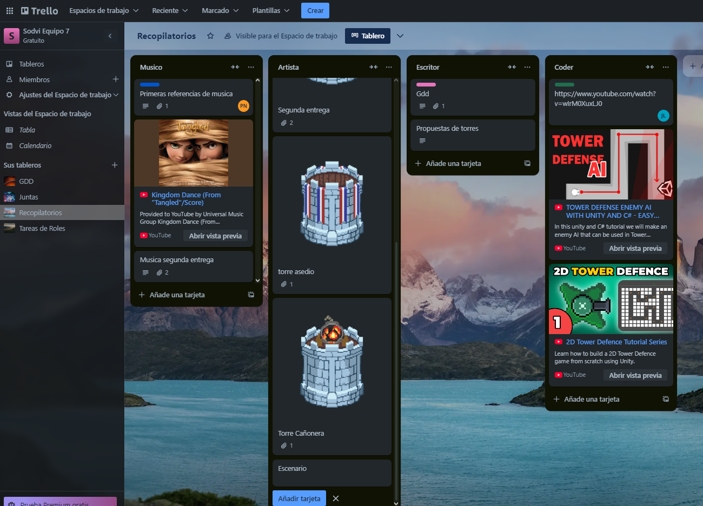
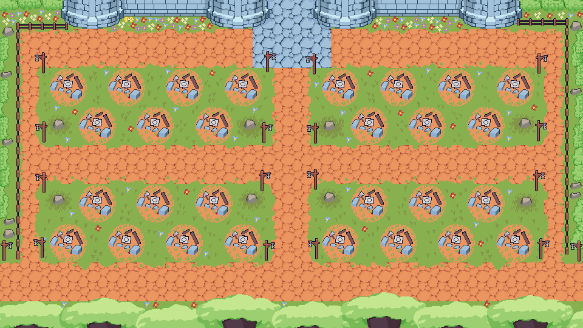

# Titulo del juego 🎮

**Equipo:** 7

**Integrantes:**

* Rafael Sánchez Durán - Escritor
* Andros Gael Calles Cedeño - Artista
* Juan Macera López - Coder
* Saldivar Pantoja Oscar - Manager
* Nathan Perez    -   Musico

**Semestre:** 2025-1

**Torre de niveles:** 3

## **Introducción:**

Con este juego se creo un juego tower defense para poder aprovechar el concepto de formato movil, teniendo asi una categoria de juego que pueda llegar a resaltar por este concepto y como se puede juntar con diferentes tipos de civilizaciones

## **Descripción del proyecto:**

1.- Lo primero que intentamos fue definir el genero del juego, optando por un tower defense, para aprovechar las caracteristicas del juego en celular

 
 
 
 

  

2,. Despues se tomo la tematica de que donde se iba a ambientar, Decidiendo el tipo de civilizaciones

 
 
 
 

  

3.- Una vez definido esto , decidimos el el tipo de estilo artistico, para que fuese pixel art

 
 
 
 

  

4.- Con esto llegamos al plan de desarrollo, teniendo asi una comunicacion constante y usar trello para mostrar avances

 
 
 
 

  

5.- Para al final ver como se iria progresando con el desarrollo poco a poco

 
 
 
 

  

## **Conclusión:** 

Oscar Saldivar pantoja: Con este videojuego, logre aprender a como se puede llevar a cabo la comunicacion de un equipo y ver las cualidades que tienen tus compa;eros y ver que al ser bastante buenas, llevarlas a otro nivel para complemetar dichas habilidades con los demas compañeros

